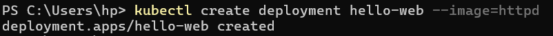
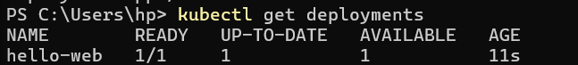
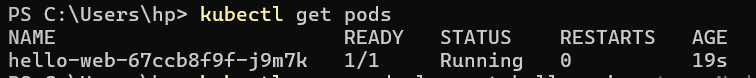

# 🚀 Hello Web App using Kubernetes (Apache httpd)

## 🎯 Objective
Deploy and manage a simple Apache web server using Kubernetes.  
Verify it is running, modify it, scale it, and debug it.

---

  **Step 1: Create Deployment**
  ```bash
  kubectl create deployment hello-web --image=httpd
  ```
  
  
  **Step 2: Verify Deployment**
  ```bash
  kubectl get deployments
  ```
  

**Step 3: Verify pods**
  ```bash
  kubectl get pods
  ```
  
  

  
