# 🚀 Hello Web App using Kubernetes (Apache httpd)

## 🎯 Objective
Deploy and manage a simple Apache web server using Kubernetes.  
Verify it is running, modify it, scale it, and debug it.

---

  **Step 1: Create Deployment**
  ```bash

  kubectl create deployment hello-web --image=httpd
  
  ```
  
  
  **Step 2: Verify Deployment**
  ```bash
  kubectl get deployments
  ```
  

**Step 3: Verify pods**
  ```bash
  kubectl get pods
  ```
  

  **Step 4: Expose deployment**
  ```bash
  kubectl expose deployment hello-web --type=NodePort --port=80
  ```
  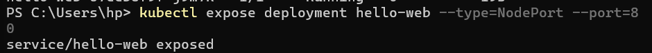

  **Step 5: Verify Service**
  ```bash
  kubectl get services
  ```
  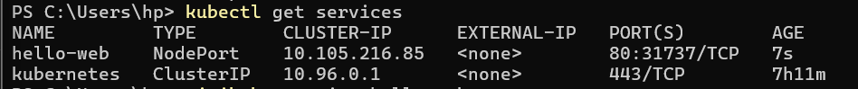

   **Step 6: Create HTML File**
  ```bash
  notepad index.html
  ```
  

  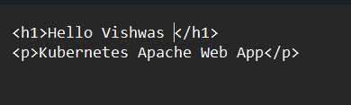

 **Step 7: Create ConfigMap**
  ```bash
  kubectl create configmap my-html --from-file=index.html
  ```
  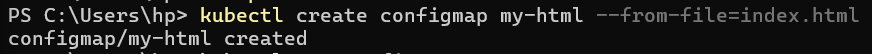
  
   **Step 8: Verify ConfigMap**
  ```bash
  kubectl describe configmap my-html
  ```
  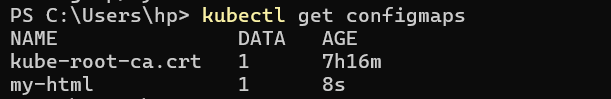
  **Step 9: Edit Deployment**
  ```bash
  kubectl edit deployment hello-web
  ```
  
  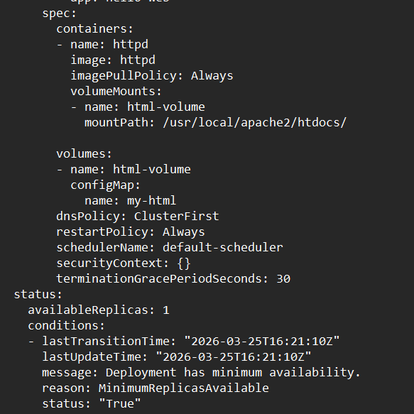
**Step 10: Restart Deployment**
  ```bash

  kubectl rollout restart deployment hello-web

  ```

  
  **Step 11: Verify Pods Again**
  ```bash
  kubectl get pods
  ```
  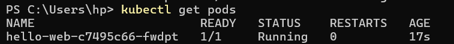
  **Step 12: Verify File inside Pod**
  ```bash
  kubectl exec -it <pod-name> -- cat /usr/local/apache2/htdocs/index.html
  ```
  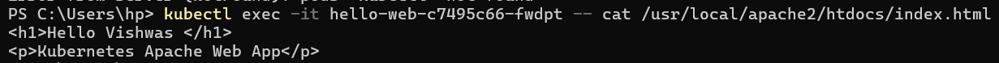
  **Step 13: Access Application**
  ```bash
  kubectl port-forward pod/hello-web-c7495c66-n5fzw 8081:80
  ```
  
  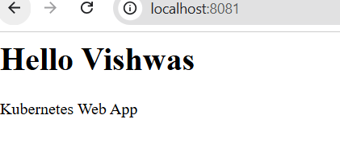
  **Step 14: Scale Deployment**
  ```bash
  kubectl scale deployment hello-web --replicas=3
  ```
  
  **Step 15: Verify Scaling**
  ```bash
 kubectl get pods
  ```
  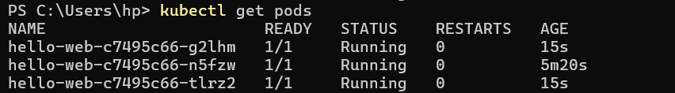
  **Step 16: Check Logs**
  ```bash
 kubectl logs  hello-web-c7495c66-n5fzw
  ```
  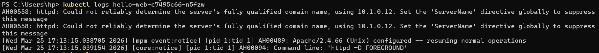


  
